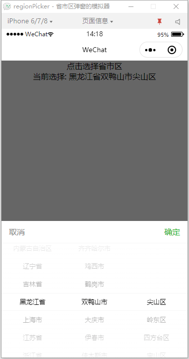
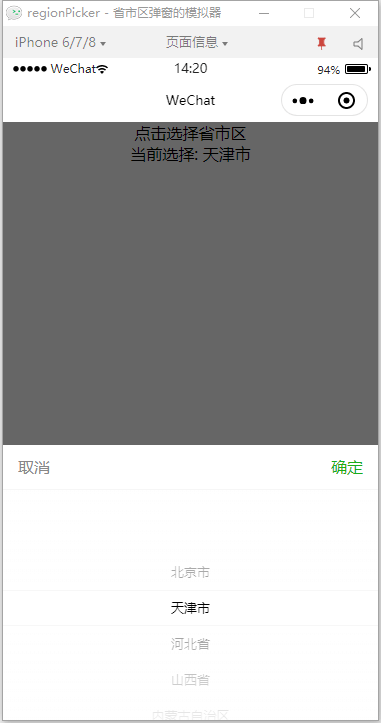
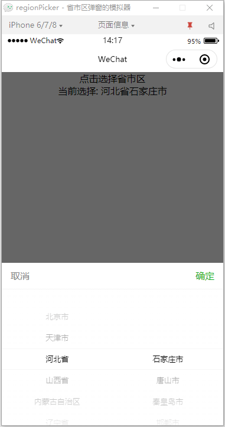
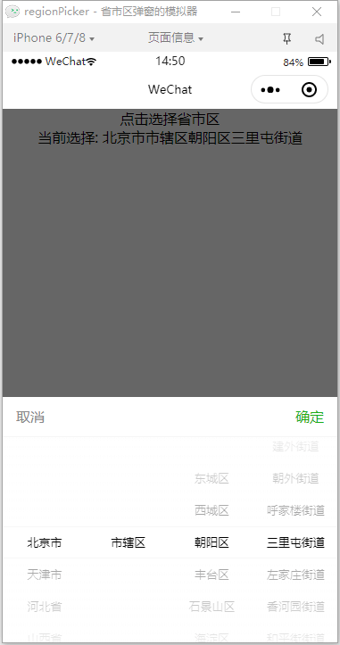

# 微信小程序 省市区组件-拖动模式

## 说明

省市区组件-拖动模式

> init-col列数：省市区共 4 列，可选 4省市区镇、3省市区(默认)、2省市、1省

> init-value初始值: 默认[0,0,0,0]

> current-id末项ID: 如果存在，将忽略初始值

> show显示: 为 true 时显示，默认隐藏

> bind:Callback选择后回调: 回调内容为 success 时成功，为 fail 时失败

**注意：**
中华人民共和国行政区划数据来源于 [Administrative-divisions-of-China](https://github.com/modood/Administrative-divisions-of-China)

## 示例

导入组件
```json
{
  "usingComponents": {
    "regionPicker": "/components/regionPicker/regionPicker"
  }
}
```
页面放置组件
```html
<regionPicker
  id="region-picker"
  bind:Callback="callRegion"
  init-col="{{regionCol}}"
  init-value="{{regionInitValue}}"
  current-id="{{regionId}}"
  show="{{regionState}}">
</regionPicker>
```
控制组件显示
```js
this.setData({
  regionState: true
});
```

## 后语

### 欢迎 Star ，后续将有更多不同的组件分享。
#### 更多了解请下载组件测试了解。
#### 演示代码片段：[https://developers.weixin.qq.com/s/9wotREmV7VgB](https://developers.weixin.qq.com/s/9wotREmV7VgB)

## 预览
### 省市区


### 省


### 省市


### 省市区镇、街道


